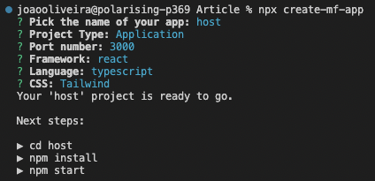
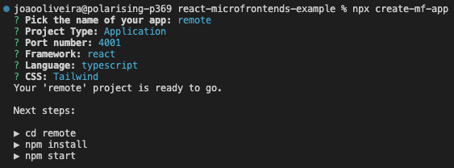
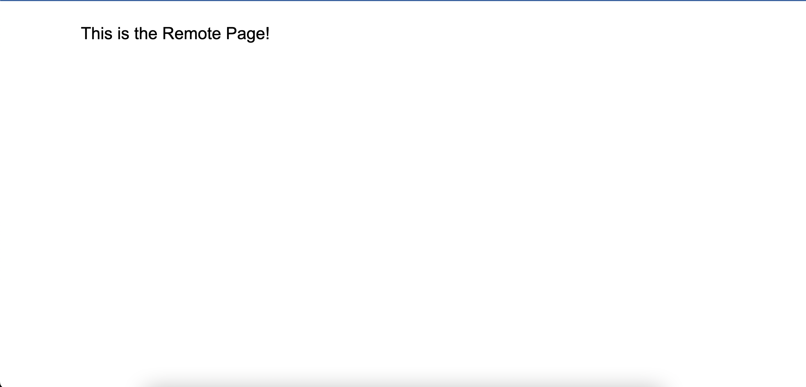
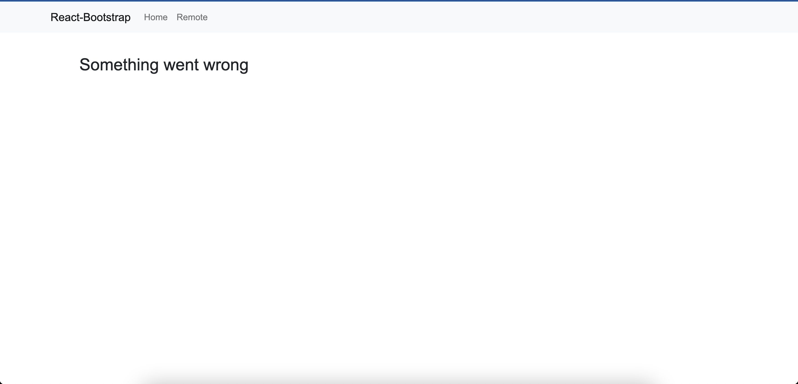
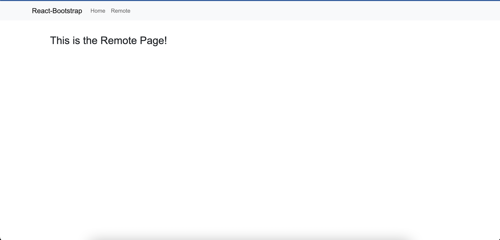

# Micro Frontends

## Introduction

The current Microservices approach to the backend of dividing the application into several independently deployed projects fixes the monolith problem, but there is still a bottleneck: the Frontend requires a new release of the whole application with the new changes. Micro Frontends (MFEs) solve that problem, by implementing the same strategy.

This article aims to provide a basic sense of Micro Frontends by answering the basic questions (what, why and how) and providing a simple example that covers other fundamental aspects of Web Development, like routing and state sharing.

## What Are They ?

MFEs are essentially portions of a web application, independently deployed and managed. They are hosted by a **Shell** (host page) and imported in the same way a normal application would import its own components. In the Shell's perspective, the MFEs are **Remotes**, because they are not intrinsic to the project. 

By separating the Frontend into Shell and Remotes, the host takes on a specific set of responsibilities, such as **Authentication**, **Navigation**, **Notifications**, **Error Handling** and **Metric Tracking**. These are the global concerns, that must be synchronized throughout the application and for that reason must be maintained by the host. 

Components which are good candidates to be turned into MFEs are self contained components that don't have dependencies to the page and small components that are shared between pages, like headers and footers.

Which leads us to the question: should you use MicroFrontends? It depends on what you need. If you need:

1) Independent builds and deployments
2) Source code isolation
3) Mixed tech stacks

then MicroFrontends are probably a good choice.

## How Do They Work ?

Micro Frontends are in of themselves a way to to solve a bigger problem, which is reliably and easily sharing code between projects.

There are several solutions to this problem, one of them being Micro Frontends using any tool like OpenComponents, Tailor, Single SPA, etc. The component is extracted, bundled, registered and consumed and once they are updated, they are updated everywhere. A problem with this solution is that the shared components are external to the projects.

Other ways to solve this problem are extracting code into a Node Package Manager (NPM) library or using Edge Side Includes (ESI), but these approaches have problems of their own like not being updated at runtime (NPM) or having compatibility issues with other frameworks, like React (ESI).

As of Webpack 5, released in 2020, there is another solution to this problem: **Module Federation**. This technology allows a Webpack build to dynamically load code from another build. Module Federation can be used for any JavaScript code, from plain functions to constants to components built with another framework, which makes it very valuable for MFEs, especially since it also allows lazy loading of the remotes.

This solution is better than the ones listed above because the shared components are not external to their projects, they are just externalized in the webpack config; as long as the project is deployed, the component is available for use everywhere and it has the most recent changes.

By combining the ease of externalization, the singleton behaviour of libraries and the ability to host components built with different frameworks, Webpack's Module Federation is a great way to build a MFE application.

## Pros

- Strategic and Tactical Focus: using MFEs the host page team can focus on general problems and leave the small interface tweaks and fixes to the MFE team; each team deals with 1 MFE so there is a lot more focus on the scope

- Reusability: MFEs can be resued as long as the host conforms to the MFE standart

- Tech Agnosticism: as long as the framework uses the MFE standart, a host page can have several MFEs written in different languages/built with different frameworks because of Module Federation

- Focused Unit Testing: by separating the code bases the tests take a shorter time because they aren't all run at once

- Streamlined Development: MFEs can be deployed whenever new changes are added without requiring an entirely new deployment of the Frontend

- Fewer Lines Of Code In Each Solution

## Cons

- Higher Complexity: an application transforms into a bigger codebase with several projects with 

- Lack of standart: there are several openSource frameworks out there but none of them are standartized 

- Framework Upgrades: if every MFE has a different repo, some projects might run different versions of the frameworks used

## Example

### Generating the Projects

In order to display the ease of use of MicroFrontends with Module Federation, I'm going to provide a basic example using React.

In the directory of your choice, run the command 

```
npx create-mf-app
```

to create a new MFE project. For the purposes of this example, I'm going to create two projects: host and remote. A few prompts will appear asking for the specs of the project, which for the host are:



After choosing the specs, the command will conclude and you can navigate to the new directory and run 

```
npm install
```

to install all the necessary dependencies. For this example we will need Bootstrap and a router, so you will need to run 

```
npm install react-router-dom
```

```
npm install react-bootstrap bootstrap
```

as well. 

Now, going back to the initial directory, we run the same create-mf-app command to generate the remote project, with the following specs:



And then navigating to this project and running 

```
npm install
```

In order to run the projects and see the generated pages, run 

```
npm start
```

in each of the project's directories.

*Note: You can choose whichever port numbers you like, just make sure they aren't the same for the host and the remote*

### Creating the Remote Page

For the remote page, we could leave it as is since the command creates a boilerplate page with the chosen specs of the project. I prefer to display a more relevant message to the
example, so in the remote project navigate to the **src** directory and create a file called **RemotePage.jsx** (src/RemotePage.jsx) with the following code:

``` typescript
import React from "react";

export default function RemotePage() {
    return(
        <div className="mt-10 text-3xl mx-auto max-w-6xl">
            This is the Remote Page!
        </div>
    )
}
```

Now, in the **src/App.jsx** file, change the code to the following:

``` typescript
import React from "react";
import ReactDOM from "react-dom";

import "./index.scss";
import RemotePage from "./RemotePage";

const App = () => (
  <RemotePage />
);

ReactDOM.render(<App />, document.getElementById("app"));
```

After these two steps you should see a page like this:



### Configuring the Host

The host requires a bit more work, so let's get to it!

First we need to create a component for the navbar. To do that, navigate to the **src** directory and create a **NavbarComponent.jsx** file:

``` typescript
import React from "react";

import Container from 'react-bootstrap/Container';
import Nav from 'react-bootstrap/Nav';
import Navbar from 'react-bootstrap/Navbar';

export default function NavbarComponent() {
    return (
        <Navbar bg="light" expand="lg">
        <Container>
          <Navbar.Brand href="#home">React-Bootstrap</Navbar.Brand>
          <Navbar.Toggle aria-controls="basic-navbar-nav" />
          <Navbar.Collapse id="basic-navbar-nav">
            <Nav className="me-auto">
              <Nav.Link href="/">Home</Nav.Link>
            </Nav>
          </Navbar.Collapse>
        </Container>
      </Navbar>
    );
  }
```

The navbar will have two tabs, the **Home** and the **Remote**, which will house
our MicroFrontend imported through Module Federation.

*Note: You'll notice this component uses Bootstrap, so don't forget to add it to the **src/index.html** file:*

``` HTML
<!DOCTYPE html>
<html lang="en">

<head>
  <meta charset="UTF-8">
  <meta name="viewport" content="width=device-width, initial-scale=1.0">
  <link
  rel="stylesheet"
  href="https://cdn.jsdelivr.net/npm/bootstrap@5.2.0-beta1/dist/css/bootstrap.min.css"
  integrity="sha384-0evHe/X+R7YkIZDRvuzKMRqM+OrBnVFBL6DOitfPri4tjfHxaWutUpFmBp4vmVor"
  crossorigin="anonymous"
/>
  <title>host</title>
</head>

<body>
  <div id="app"></div>
</body>

</html>
```

Next, we need to create our Home page and add the router. We'll start with the Home page, which will be on the **src/Home.jsx** file:

``` typescript
import React from "react";

export default function Home() {
    return (
        <div className="mt-10 text-3xl mx-auto max-w-6xl">Home page</div>
    );
  }
```

And now the router, which will be on the **src/App.jsx** file:

``` typescript
import React from "react";
import ReactDOM from "react-dom";

import "./index.scss";

import { BrowserRouter,  Routes, Route} from "react-router-dom";

import Home from './Home'

import NavbarComponent from "./NavbarComponent";

const App = () => (
    <BrowserRouter>
    <NavbarComponent />
      <div className="text-3xl mx-auto max-w-6xl">
        <div className="my-10">
          <Routes>
            <Route path="/" element={ <Home />}></Route>
          </Routes>
        </div>
      </div>
    </BrowserRouter>
    );


ReactDOM.render(<App />, document.getElementById("app"));
```

### Exposing the Remote Page

After all this setup, it's time for some Module Federation Magic. We'll start by going to the **/remote/webpack.config.js** file and exposing our Remote Page:

```javascript 
plugins: [
    new ModuleFederationPlugin({
      name: "remote",
      filename: "remoteEntry.js",
      remotes: {},
      exposes: {
        "./RemotePage": "./src/RemotePage.jsx"
      },
      shared: {
        ...deps,
        react: {
          singleton: true,
          requiredVersion: deps.react,
        },
        "react-dom": {
          singleton: true,
          requiredVersion: deps["react-dom"],
        },
      },
    }),
    new HtmlWebPackPlugin({
      template: "./src/index.html",
    }),
  ],

```

In the **Plugins** array you'll see a **ModuleFederationPlugin** with a **remotes** and **exposes** property. Since we want to expose the RemotePage, we'll add the path of the component in the **exposes**.

The Remote is all done, now on to importing the component in the Host.

### Importing Remote 

In order to import a MFE, we need to go to the **webpack.config.js** of the project where we want to import the component and locate the **plugings** array, like we did to expose our RemotePage. For our host, it should be in the **host/webpack.config.js** file. To connect both projects, we're going to pass to the host the URL of the Remote's **remoteEntry.js** file:

```javascript
plugins: [
    new ModuleFederationPlugin({
      name: "host",
      filename: "remoteEntry.js",
      remotes: {
        remote: "remote@http://localhost:4001/remoteEntry.js"
      },
      exposes: {},
      shared: {
        ...deps,
        react: {
          singleton: true,
          requiredVersion: deps.react,
        },
        "react-dom": {
          singleton: true,
          requiredVersion: deps["react-dom"],
        },
      },
    }),
    new HtmlWebPackPlugin({
      template: "./src/index.html",
    }),
  ],
```

*Note: if you chose another port number for the remote, use that instead of 4001*

### Using a MicroFrontend

Now the fun part: using our new component. 

First, we're going to add a **Remote** tb to our navbar:

**host/src/NavbarComponent.jsx**

```typescript
import React from "react";

import Container from 'react-bootstrap/Container';
import Nav from 'react-bootstrap/Nav';
import Navbar from 'react-bootstrap/Navbar';

export default function NavbarComponent() {
    return (
        <Navbar bg="light" expand="lg">
        <Container>
          <Navbar.Brand href="#home">React-Bootstrap</Navbar.Brand>
          <Navbar.Toggle aria-controls="basic-navbar-nav" />
          <Navbar.Collapse id="basic-navbar-nav">
            <Nav className="me-auto">
              <Nav.Link href="/">Home</Nav.Link>
              <Nav.Link href="/remote">Remote</Nav.Link>
            </Nav>
          </Navbar.Collapse>
        </Container>
      </Navbar>
    );
  }
```

And then we'll add the Route to our Router in **host/src/App.jsx** and import the **RemotePage** like it was a normal component:

```typescript
import React from "react";
import ReactDOM from "react-dom";

import "./index.scss";

import { BrowserRouter,  Routes, Route} from "react-router-dom";

import Home from './Home'

import NavbarComponent from "./NavbarComponent";

import RemotePage from 'remote/RemotePage';

const App = () => (
    <BrowserRouter>
    <NavbarComponent />
      <div className="text-3xl mx-auto max-w-6xl">
        <div className="my-10">
          <Routes>
            <Route path="/" element={ <Home />}></Route>
            <Route path="/remote" element={<RemotePage />}></Route>
          </Routes>
        </div>
      </div>
    </BrowserRouter>
    );


ReactDOM.render(<App />, document.getElementById("app"));
```

Notice how we imported from remote/RemotePage:

```
import RemotePage from 'remote/RemotePage'
```

We do this because when we specified the remote in the webpack.config.js file, we used 

```
remotes: {
        remote: "remote@http://localhost:4001/remoteEntry.js"
      }
```

If our project had another name, we would change this to

```
remotes: {
        anotherName: "anotherName@http://localhost:4001/remoteEntry.js"
      }
```

```
import RemotePage from 'anotherName/RemotePage'
```

And that's it. Just rerun both projects and you should have a functional MFE project with a Home page and a Remote page, running on another project and imported at runtime.

With this basic example running, it's really easy to spot the advantages of this approach. If you change the **RemotePage.jsx** file (and assuming there are no errors) you'll notice that all it takes on the Host's side to get the new version is refreshing the page. 

### Error Handling

The problem is that things don't run well 100% of the time. Sometimes the MFE team makes a breaking change or the Remote crashes and everything falls apart. You can replicate this behaviour by stopping the **remote** process.

As good as this is, there is still room for improvement. The whole point of this is reducing bundle sizes and having different teams work on each MFE, but so far we haven't reached this level of improved workflow and deployment.

We can take advantage of React's **Lazy** and **Suspense** to guard our host against errors from the Remote, and make the whole application more robust as a result.

In order to do this, start by adding a **SafeComponent** in your **host/src** directory, with the following code:

```typescript
import React from "react";

export default class SafeComponent extends React.Component {
    constructor(props) {
        super(props);
        this.state = { hasError: false };
    }

    static getDerivedStateFromError(error) {
        return { hasError: true };
    }

    componentDidCatch() {}

    render() {
        if(this.state.hasError) {
            return <h1>Something went wrong</h1>
        }

        return this.props.children;
    }
}
```

Then we'll create a **SafeRemoteComponent.jsx**, also in the **src** folder:

```typescript
import React, {Suspense} from "react";

import SafeComponent from "./SafeComponent";

const RemotePage = React.lazy( () => import('remote/RemotePage'))

export default function SafeRemoteComponent() {
    return(
        <SafeComponent>
            <Suspense fallback={<div>Loading...</div>}>
                <RemotePage />
            </Suspense>
        </SafeComponent>
    );
}
```

This is the place where the magic happens. First we lazy load our **Remote** page, which will grant us the faster load times when we open the application. Then, we use Suspense to display a fallback message in case the application takes a long time loading the remote (or can't load it at all). Now we just need to add this to our Router, and it's done:

**host/src/App.jsx**

```typescript
import React from "react";
import ReactDOM from "react-dom";

import "./index.scss";

import { BrowserRouter,  Routes, Route} from "react-router-dom";

import Home from './Home'

import NavbarComponent from "./NavbarComponent";

import SafeRemoteComponent from "./SafeRemoteComponent";

const App = () => (
    <BrowserRouter>
    <NavbarComponent />
      <div className="text-3xl mx-auto max-w-6xl">
        <div className="my-10">
          <Routes>
            <Route path="/" element={ <Home />}></Route>
            <Route path="/remote" element={
                <SafeRemoteComponent />
            }></Route>
          </Routes>
        </div>
      </div>
    </BrowserRouter>
    );


ReactDOM.render(<App />, document.getElementById("app"));
```

Now, if you rerun Host, you'll see a more pleasant "Something Went Wrong" message in the remote tab instead of a hard crash:



And now with no error:



## Sources

JackHerrington. (2022, February 25). *Micro-Frontends: What, why and how* [Video]. YouTube. Retrieved June 6, 2022, from https://www.youtube.com/watch?v=w58aZjACETQ

JackHerrington. (2021, October 14). *Micro-FrontendsIn Just 10 Minutes* [Video]. YouTube. Retrieved June 7, 2022, from https://www.youtube.com/watch?v=s_Fs4AXsTnA

JackHerrington. (2020, March 7). *Introducing Module Federation in Webpack 5* [Video]. YouTube. Retrieved June 14, 2022, from https://www.youtube.com/watch?v=D3XYAx30CNc

Jackson, Z. (2020, March 2). Webpack 5 Module Federation: A game-changer in Javascript architecture. | The Startup. Medium. Retrieved June 14, 2022, from https://medium.com/swlh/webpack-5-module-federation-a-game-changer-to-javascript-architecture-bcdd30e02669

Module Federation. (n.d.). Webpack. Retrieved August 23rd, 2022, from https://webpack.js.org/concepts/module-federation/

freeCodeCamp.org. (2021, November 10). *Micro-Frontends Course - Beginner to Expert* [Video]. YouTube. Retrieved August 23, 2022, from https://www.youtube.com/watch?v=lKKsjpH09dU&ab_channel=freeCodeCamp.org

Mecham, O. (n.d). *Workshop: Advanced Application Architecture with MicroFrontends Part 1*. Pluralsight. https://app.pluralsight.com/library/courses/ng-conf-2021-session-38-part-1/table-of-contents


